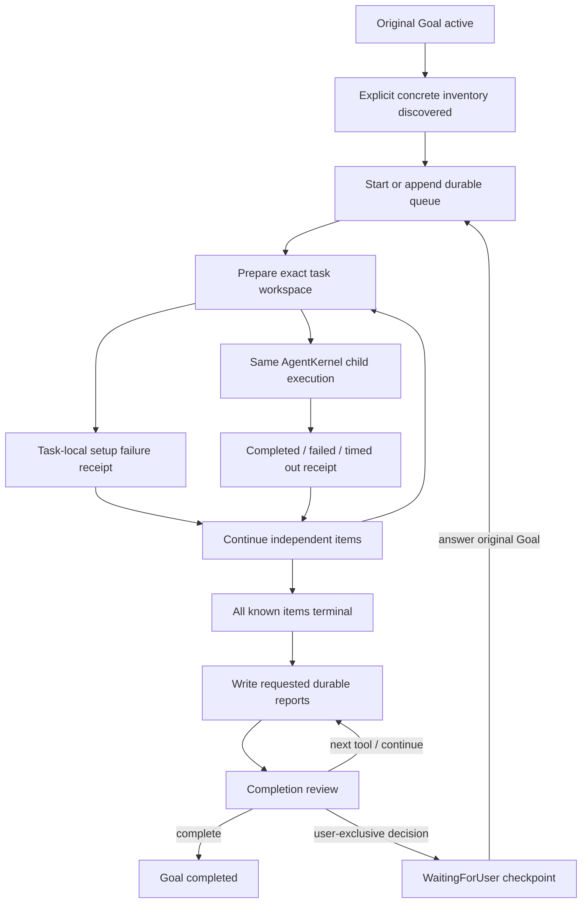

# Coding harness 修复与验收

> 历史验收快照（AX 0.3.4）：下文记录当时的 completion review 实现和黑盒结果。
> 2026-10-04 起默认完成机制已被 [continuation loop](agent-loop.md) 取代；
> 不再默认审查 final。本文保留历史证据，不作为当前完成机制规范。


## 1. 根因

| 根因 | 修复 |
|---|---|
| 无 queue 时普通 final 可结束未执行的批量目标 | 拟结束回复经过 completion review，注册明确工作或请求下一工具动作 |
| 已有 pending queue 时普通文本把整个目标终止为 blocked | 按 queue state 留在原 Goal，继续调度/执行 |
| 模型把缺 runner/venv/package 当全局停止 | 短 policy + task-local receipt；global block 要求真实 typed envelope evidence |
| 动态数据发现后没有确定性的工作登记 | `ax_work_items` 显式协议 + 通用投影 `task_source`，不解析 bullet/编号 |
| 已执行 setup queue 后不允许接入真正工作项 | `append` 保留历史、task ID、receipt，并追加明确任务 |
| 独立 completion 调用使用非 streaming API | 共用 streaming/provider retry path；真实 Codex HTTP400 已定位并补回归 |
| 已索引 global skill 被 workspace scope 拒绝 | 只有 registry-owned skill 读取获 runtime-owned capability |
| Child 只会继承 controller repository | 每 task WorkspaceSpec，模型请求之前准备 URL/revision/cache/worktree |
| Git record 映射遗漏 revision 后静默 HEAD | 要求显式 revision_column/common revision；明确选择顺序 |
| 模型 step.scope 猜出 workspace/workspace 锁住恢复 | harness 下 step scope advisory；初始 workspace/sandbox/权限仍强制 |
| relative output_dir 与 host absolute contract 不一致 | 数据源和直接 task_queue 都按所属执行/source 目录解析 |
| subdir 只改变临时 binding，saved cwd/root 不一致 | ChildRun 分离真实 cwd 与 lifecycle workspace_root；工具/沙箱分别绑定 |
| setup failure receipt 使用空 child ID，可能互相覆盖 | goal/task 唯一 ID + 独立 durable setup receipt |
| cleanup/GC 前没有冻结完整 patch/自定义输出 | synced state/output artifacts → durable receipt → cleanup；staging export |
| Child final 未经过同一 completion review | controller/child 共用审查；已接受的审查不掩盖原工具失败，并可恢复 receipt |
| 终态摘要缺 task identity/output，review 缺全量摘要 | summary 同时包含 title/task_id/revision/output/receipt refs，review 使用同一快照 |
| review 只能说 continue，模型可能反复输出旧 final | review 可请求普通工具，仍经过同一 scheduler/permissions/checkpoint |
| final 候选先 checkpoint、审查未完成时恢复可误判 terminal | 候选前持久化 pending marker，只有 accepted audit 才恢复终态；legacy raw history 保持兼容 |
| child-timeout 复用 controller idle timer，重复写文件会无限续期 | 显式 child timeout 限制整个模型/工具执行；主 controller 仍按 idle，超时独立 receipt 后继续 |
| Git 已准备但 child 只收到 cwd，重复 clone 到 repo 子目录 | 注入准备完成的 WorkspaceSpec/revision/cwd 与直接在当前 checkout 工作的说明 |
| 把跨任务汇总派给没有输入的 empty workspace child | 终态摘要明确要求 controller 读取当前 receipt 并生成报告，隔离 report child 需要完整输入 |
| 输出目录已有 result 被误当成本轮自定义结果 | 只保留当前 staging 生成的 result，否则覆盖为本轮 receipt；列出本轮报告 artifacts |
| task_source.work 被模型 JSON 编码为字符串，误报缺字段 | 兼容明确 JSON 对象编码，其他形状给出准确可恢复诊断并补回归 |
| 首轮工具列表构建时尚无 child receipt，遗漏 child_result | 有 ChildHost 就提前公布查询工具，首次 dispatch 后可以读取结果 |
| 非 Git shell 编辑缺少文件事件，cleanup 可能漏存 | 准备时保存内容指纹，清理前比较并保存实际变更文件 |
| binary/unavailable diff 或缺失 round usage 被计为零/部分总数 | nullable diff/usage，未知值保持 null，staging 写入不计代码编辑 |
| report 仅凭既有文件存在和可选 receipt 查询，终态审查丢失本轮证据 | Summarizing/Completed 直接注入当前 receipt 状态、metrics、diff 和文件索引；本轮 manifest 排除历史自定义文件 |
| manifest 遗漏 Host 生成的文件，报告把真实 result/trace 误作缺失 | 所有 Host 输出注册 Artifact/manifest，setup failure 使用相同 durable receipt surface |
| 汇总/候选 final 承认缺报告后仍被接受，旧 summary 被重复引用 | 明确失败项也要报告、未知值 null；直接当前文件证据，最终黑盒采用空输出目录排除历史报告 |

启动诊断另遇到一次默认 portable-home migration 停滞（未确认并未宣称已修复）
及配置的 OpenAI proxy HTTP403。最终验收显式复用已有 AX_HOME 身份配置，使用
原生 `codex` provider；不将这些早期尝试当成终态验收。

## 2. 修改模块

- core: harness、kernel goal state、task_queue、loop_runtime/provider_step、
  child/child_dispatch/child_result、execution scope。
- cli: runtime/builder、共享 configure_controller、child_runtime/workspace、
  indexed skill admission。
- tool: environment、task_source、sandboxed/RunContext。
- 测试: test/harness/{core,task_source,workspaces,frontend,child_deadline}.rs 和既有回归。
- 对应功能 docs 与独立工作日志已同步；AXCrew 未修改。

## 3. 当前实际 Harness Policy

```text
[ax-coding-harness]
Execute requested deliverables until completed, failed with evidence, or waiting for a necessary user decision. Missing venv, pytest, packages, runner, uncloned repo or no search matches are recoverable setup/task-local observations: attempt installation, creation or fallback, then record a local failure and continue independent work. Honor user-requested ordering: sequential work runs one item at a time; choose parallel execution only when compatible with the user goal. Do setup and data reads before queueing. Queue items must be concrete user deliverables, never a preliminary discovery/reporting checklist. Use task_source projected columns and work mapping for tables; it automatically registers records as children. Otherwise register concrete executable items with task_queue once known. Data readers may return {"ax_work_items":[{"title":...,"input":...,"workspace":...,"output_dir":...}]} to register work automatically. Each child input must include all its necessary data and output requirements, never sibling results or reference answers. Select allowed dataset columns at the reader, before loading data; execution and evaluator inputs stay separate. Use repo/config/tools to answer discoverable questions. Only user-exclusive decisions use request_user_input, which suspends/resumes the goal. A final answer requires every known item terminal and all requested durable reports written. Freeze patches and save results before workspace cleanup. An unavailable official evaluator leaves official_resolved=null and does not prevent coding/local validation.
```

## 4. Long-task activation



只有 producer 明确给出的 executable inventory 或模型显式 task_queue 进入队列。
普通 numbered/bullet 说明不触发自动拆分。用户要求顺序执行时用 shared write
resource 串行，不用 success dependency，前一题失败不会跳过后一题。

## 5. Completion guard

Known pending/running queue 状态阻止 controller 普通 text-only 成功结束。
未知 inventory 由语义审查检查原任务与真实工具历史，要求具体 queue/下一动作。
所有拟结束的 controller/child 回复共用 streaming review；审查本身计入模型步骤。
Child 终态审查仍保留原工具失败，且崩溃后可从原 candidate 恢复。
Summarizing 和 Completed 请求/审查直接注入当前 receipt 的 status/metrics/diff/file index，排除历史输出作为本轮证据。
这是 advisory completion policy，没有 observed-progress gate/recovery tool lock。

## 6. WorkspaceSpec

inherit = 既有受过滤 snapshot/dirty overlay；empty = 独立空目录；git =
repo cache availability → clone/fetch → resolve exact commit → detached worktree
（sandbox off）或独立 confined object store → subdir cwd → child。
workspace_root 控制 lifecycle/sandbox/patch root，cwd 控制具体工具路径。
失败只形成本 task receipt，其他独立 task 继续。

## 7. EnvironmentContext

Main/Child 使用同一 lazy process cache，提供 OS、shell contract、cwd/root、
path separator、detected executable path/version、network/sandbox/write boundary。
Windows 注入 PowerShell 5.1，明确禁止 bash heredoc 与 &&/||，使用 here-string。
完整字段示例见 [coding-harness.md](coding-harness.md#environment-and-errors)。

## 8. 错误分类

| 类型 | 行为 |
|---|---|
| missing pytest/venv/optional runner/package、no-match、uncloned repo | recovery/fallback；失败后 task-local，继续独立任务 |
| workspace preparation/child execution/provider failure | 对应 child evidenced failed/timeout receipt |
| typed shared global blocker、controller provider exhaustion、persistence failure | 真实阻断路径；不凭模型文字假定 |
| configured budget/timeout / user cancellation | 现有 suspended/cancelled 路径 |
| 必须用户提供的决定 | structured request_user_input → checkpoint → answer/resume same Goal |

缺官方 evaluator 不阻止 coding/local validation；未运行官方 evaluator 时
`official_resolved=null`，completed receipt 不代表官方 benchmark resolved。

## 9. Artifact durability

Host 在 cleanup 前捕获 binary/full-index final.patch、Git authoritative changed
files/diff_stat、自定义 staging artifacts、diagnostics、validation、metrics 和 trace。
同时保存独立 state 与指定 output，atomic rename + sync 后才落 receipt/清理。
`.ax-artifacts/` 避免 child 写外部输出被 scope 拒绝，且不污染代码 patch。
GC 复用保存的 output/source capability，未保存成功就不清理。

## 10. CLI / ACP / Crew

CLI run / REPL-TUI run_prompt_with / ACP run_session_prompt
→ ReplState runtime composition + configure_controller
→ same AgentKernel/AgentSupervisor/LocalChildHost/tools/budgets/checkpoints。
Crew 调用同一 AX ACP process，没有另外实现 loop。CLI 与 ACP 自动 23-item
真实 child dispatch 回归已通过；真正 request_user_input suspend/resume 已有回归。

## 11–12. 原始 testax 黑盒

最终运行 blackbox-21 已通过本次交付验收，AX 正常退出 0。
使用最新构建、干净 data-dir/session、空 axout，**整份原始 testax.txt 一次性输入**；
不是人工逐题调用，不要求所有题目修复正确。原生 codex/gpt-6-luna/low，child timeout 900s。
原始 23 项 **19 completed / 4 failed / 0 timeout**；一个额外重复注册 helper setup quota failure 不计实例。
AX 自己生成每项 result.json、trace.jsonl、final.patch、evaluation.json（23/23），
并生成 summary.csv（23 行）、summary.json（23 records）、report.md。逐项 summary status 与本轮 ChildResult 一致。
解题 task_source 只投影 instance_id/repo/base_commit/problem_statement，没有读取 gold/test/reference/Codex 答案。
official_resolved 全部 null，没有执行官方 harness。22 项非空权威 patch；一项空 patch，不能据 completed 判断修复正确。
多个不同 repo 实际修改/运行局部验证；失败回执和清理后文件均保留。
终态后 controller 自己补齐 evaluation 报告并生成汇总，未由外部手工制造 benchmark 产物。

输出：`C:\Users\14181\Desktop\axlab\axout`。
证据：`test/harness/blackbox-21/console.log`、`events.jsonl`、`data/child-runs/*/state/result.json`。
Session: `23af378b-7d24-41f8-8f9a-0f11d0191dbd`；Goal: `goal-c204-18db169681cdb3e8-0`。

| # | instance | terminal | 说明 |
|---|---|---|---|
| 1 | marshmallow-code__marshmallow-1343 | completed | receipt completed; official evaluation null |
| 2 | marshmallow-code__marshmallow-1359 | completed | receipt completed; official evaluation null |
| 3 | pvlib__pvlib-python-1072 | failed | local verification/tool failure |
| 4 | pvlib__pvlib-python-1154 | completed | receipt completed; official evaluation null |
| 5 | pvlib__pvlib-python-1606 | completed | receipt completed; official evaluation null |
| 6 | pvlib__pvlib-python-1707 | completed | receipt completed; official evaluation null |
| 7 | pvlib__pvlib-python-1854 | completed | receipt completed; official evaluation null |
| 8 | pydicom__pydicom-1139 | failed | unknown tool result dependency |
| 9 | pydicom__pydicom-1256 | completed | receipt completed; official evaluation null |
| 10 | pydicom__pydicom-1413 | completed | receipt completed; official evaluation null |
| 11 | pydicom__pydicom-1694 | completed | receipt completed; official evaluation null |
| 12 | pydicom__pydicom-901 | completed | receipt completed; official evaluation null |
| 13 | pylint-dev__astroid-1196 | failed | unresolved tool failure |
| 14 | pylint-dev__astroid-1268 | completed | receipt completed; official evaluation null |
| 15 | pylint-dev__astroid-1333 | completed | receipt completed; official evaluation null |
| 16 | pylint-dev__astroid-1866 | completed | receipt completed; official evaluation null |
| 17 | pylint-dev__astroid-1978 | failed | model transport response decode error |
| 18 | pyvista__pyvista-4315 | completed | receipt completed; official evaluation null |
| 19 | sqlfluff__sqlfluff-1517 | completed | receipt completed; official evaluation null |
| 20 | sqlfluff__sqlfluff-1625 | completed | receipt completed; official evaluation null |
| 21 | sqlfluff__sqlfluff-1733 | completed | receipt completed; official evaluation null |
| 22 | sqlfluff__sqlfluff-1763 | completed | receipt completed; official evaluation null |
| 23 | sqlfluff__sqlfluff-2419 | completed | receipt completed; official evaluation null |

AX 最终文字还提及初始化 quota；本轮该 quota 属于额外 helper，并非原始 23 项中的失败。
权威逐项表/summary 的 4 个失败原因见上表，不把辅助任务混入 benchmark。

复现入口：

```powershell
$env:AX_HOME='C:\Users\14181\.ax'
$taskText=Get-Content -LiteralPath 'C:\Users\14181\Desktop\axlab\testax.txt' -Raw
& 'C:\Users\14181\Desktop\axlab\ax\test\harness\blackbox-21\ax.exe' --provider codex --model gpt-6-luna --reasoning-effort low --data-dir '<new-empty-data-dir>' --allow-dangerous --child-timeout-secs 900 run $taskText
```

以下为排障历史，均不是最终验收：

blackbox-11：23 durable receipts，17 completed / 6 failed / 0 timeout。
最后五个失败及 controller stop 包含原生 provider HTTP429
`usage_limit_reached`（reset UTC 2026-10-03 09:45:27），总报告未生成，
该轮不算完整验收。限额重置后使用最新二进制开始 blackbox-12，未更换模型。该轮 work 参数被 JSON 编码为字符串，
工具误报字段缺失，模型错误请求用户启用执行器。兼容修复和回归通过后，
以最新构建重新开始 blackbox-13；此前两轮均不算完整验收。
blackbox-13 原始 23 项全部终态（17 completed / 6 failed / 0 timeout）；
汇总被派给无数据的 empty workspace child 后重复恢复，仍未生成所需总报告。
定位并补终态摘要/回归后停止该轮，最新 blackbox-14 独立重跑。该轮模型在已准备的 Git workspace 内
再次 clone repo；缺少准备完成的明确 context 会使 authoritative diff 读错仓库。
补 task workspace context + 两仓库首请求回归后停止该轮，用 blackbox-15 重跑。该轮已避免嵌套 clone；但第 6 项重复写 incomplete
产物会刷新 idle timer，显式 child timeout 没有限制实际运行时长。补 child
总执行时限和持续活动超时/下一项继续回归后，使用 blackbox-16 重跑。随后完成恢复路径审查发现未接受的 final
候选可被 raw history recovery 当成 terminal；补 durable pending marker、checkpoint
顺序和 accepted/unaccepted recovery 回归后，用 blackbox-17 最新构建重跑。

原始 testax SHA256：
`14522F3E555F0EA98CB2F1E0B15F547019F029FEB6F5799F6362D40D5D50A6EB`

## 13. 验证与剩余限制

当前：cargo fmt --all PASS；cargo clippy --workspace --all-targets exit 0
（既有未相关 warnings）；cargo test --workspace 535 passed / 0 failed / 3 ignored。
Final 黑盒后再次运行 fmt/clippy/workspace tests 均通过：535 passed / 0 failed / 3 ignored。
一次完整测试曾遇到既有 WorkBuddy timestamp temp credential race；isolated retry
和完整重跑均通过，未更改 auth/model 生产代码。

审查仍依赖模型判断交付是否完整，不保证 code correctness。当前实测平台是
Windows/PowerShell、sandbox off；confined/Linux 支持路径由既有 tests 覆盖，
本轮没有在 Linux 主机执行。Provider 网络错误仍可能使单题失败，但会保存诊断
并继续。Unknown measured/error/evaluation values 应为 null，禁止估算。

## 14. 模型

所有验收命令明确使用 `--provider codex --model gpt-6-luna --reasoning-effort low`。
Task queue child 继承同一 provider；没有针对 dataset/repository 的生产特判。


blackbox-17 原始 23 项均 completed，0 failed/timeout，且 AX 自动生成三个总报告。报告将六种自定义状态误作失败，部分 evaluation 来自旧轮，最终答复引用历史配额失败，故未接受验收。完成队列仍注入终态摘要；输出增加当前 artifact manifest，汇总明确使用 canonical receipt 与实测 metrics，未知值保持 null。补 Completed review 和旧 evaluation provenance 回归后以 blackbox-18 干净重跑。


blackbox-18：5 completed / 18 failed / 0 timeout，23 个当前权威回执；后 18 项和 controller 均为 native codex HTTP429 usage_limit_reached，reset 2026-10-03 22:48:02 Asia/Shanghai，未生成本轮总报告。22:55 核对重置时间已过，以相同二进制/model启动 blackbox-19 干净完整原提示测试。验收不要求所有问题修复正确，要求每项处理及所需文件/汇总实际生成；没有人工逐题驱动。


blackbox-19：20 completed / 3 failed / 0 timeout，AX 自己生成三份新汇总并退出 0；统计使用本轮权威回执，未知字段 null。清单漏记 Host 的 result/trace，报告误报这些文件缺失；部分本轮 evaluation 仍缺失。补全 Host/prepare-failure manifest 和回归，明确最终审查为成功/失败项补齐请求的报告文件后，blackbox-20 完整原提示重跑。


blackbox-20：原始 23 项 20 completed / 3 failed / 0 timeout（另 2 个辅助任务 setup failure 不计实例）。AX 仅刷新 report.md，两个 summary 仍旧，逐题报告未补齐，因此不接受。增加 compact current receipt/file index 直接注入 terminal summarization/review；host outputs 同时登记到 ChildResult artifacts。旧 axout 整体保存在 test/harness/blackbox-20/previous-axout，空输出目录下 blackbox-21 完整原提示验收，不手工制造结果。


最终限制：completion review 为 advisory 语义审查，不保证任意模型/工作负载必然正确交付；本轮验证完整提示的持续执行及文件报告交付。失败项保存真实证据，官方 correctness 未验证。Evolution 后台经验调用仍日志 HTTP400 Stream must be set to true，但主 coding path/报告完成且退出 0；该非阻断既有分支未在本任务扩展修改。模型工具协议/网络响应错误仍可造成局部失败。
